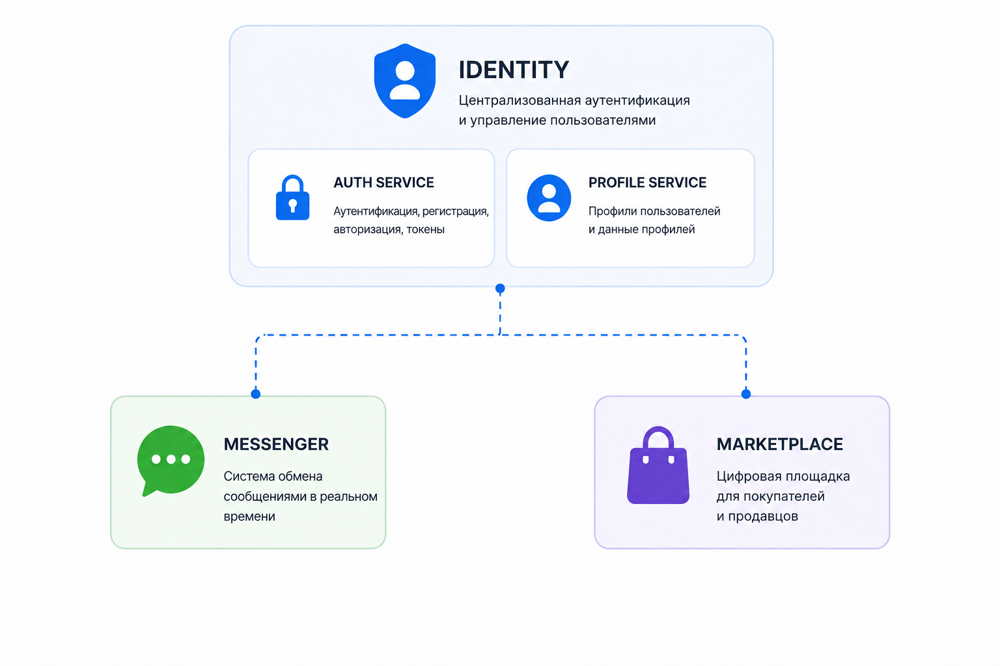

# Burkina Ecosystem

> Единая экосистема независимых сервисов, построенная на основе единой идентификации пользователя.

Burkina - это растущая экосистема взаимосвязанных сервисов, предназначенных для предоставления пользователям единой учетной записи и беспрепятственного использования всех продуктов.

Пользователь регистрируется **один раз, используя свой номер телефона**, и получает уникальную учетную запись с адресом электронной почты в домене`@burkina.ru`. Затем эта учетная запись может быть использована для доступа ко всем сервисам экосистемы.

---

## 🌐 Обзор

Основная идея Burkina Ecosystem:

> **Зарегистрируйся один раз — пользуйся всеми сервисами.**

Вместо создания отдельной учётной записи для каждого приложения пользователь получает единую идентичность, которая используется во всей экосистеме.

Каждый сервис разрабатывается и поддерживается независимо, в то время как **Identity** предоставляет общую систему управления пользователями и аутентификации.

---

## 🧩 Проекты

На данный момент экосистема состоит из следующих проектов:

| Project         | Description                                        | Repository                                                |
|-----------------|----------------------------------------------------|-----------------------------------------------------------|
| **Identity**    | Центральная система идентификации и аутентификации | [Identity](https://github.com/Bazu-Bazu/Burkina-Identity) |
| **Messenger**   | Мессенджер для пользователей экосистемы            | [Messenger](https://github.com/Bazu-Bazu/Messenger)       |
| **Marketplace** | Площадка для покупки и продажи товаров             | [Marketplace](https://github.com/Bazu-Bazu/Marketplace)   |
| **Common**      | Общие файлы и переиспользуемые компоненты          | [Common](https://github.com/Bazu-Bazu/Burkina-Common)     |

> В дальнейшем в экосистему будут добавляться новые сервисы.

---

# 🔐 Identity

**[Identity](https://github.com/Bazu-Bazu/Burkina-Identity)** — центральный компонент экосистемы Burkina.

Он отвечает за управление пользователями, аутентификацию, авторизацию и пользовательские профили.

---

## 📱 Регистрация пользователя

Регистрация пользователя осуществляется **по номеру телефона**.

Номер телефона является основным идентификатором пользователя при регистрации.

После успешной регистрации система создаёт учётную запись пользователя и назначает ей адрес электронной почты в домене `@burkina.ru`.

Таким образом, пользователю не требуется создавать отдельную учётную запись для каждого сервиса.

---

# 💬 Messenger

**[Messenger](https://github.com/Bazu-Bazu/Messenger)** — сервис обмена сообщениями внутри экосистемы Burkina.

Он позволяет пользователям общаться друг с другом, используя существующую учётную запись Burkina.

Для использования Messenger пользователю не требуется создавать отдельный аккаунт.

---

# 🛒 Marketplace

**[Marketplace](https://github.com/Bazu-Bazu/Marketplace)** — торговая площадка экосистемы Burkina.

Пользователи взаимодействуют с Marketplace, используя существующую учётную запись Burkina.

Аутентификация и идентификация пользователей выполняются через Identity, что позволяет Marketplace сосредоточиться на своей основной бизнес-логике.

---

# 📦 Common

**[Common](https://github.com/Bazu-Bazu/Burkina-Common)** — общая библиотека, содержащая переиспользуемую функциональность для нескольких проектов экосистемы.

Основная задача Common — избежать дублирования одинаковой функциональности в независимых сервисах.
